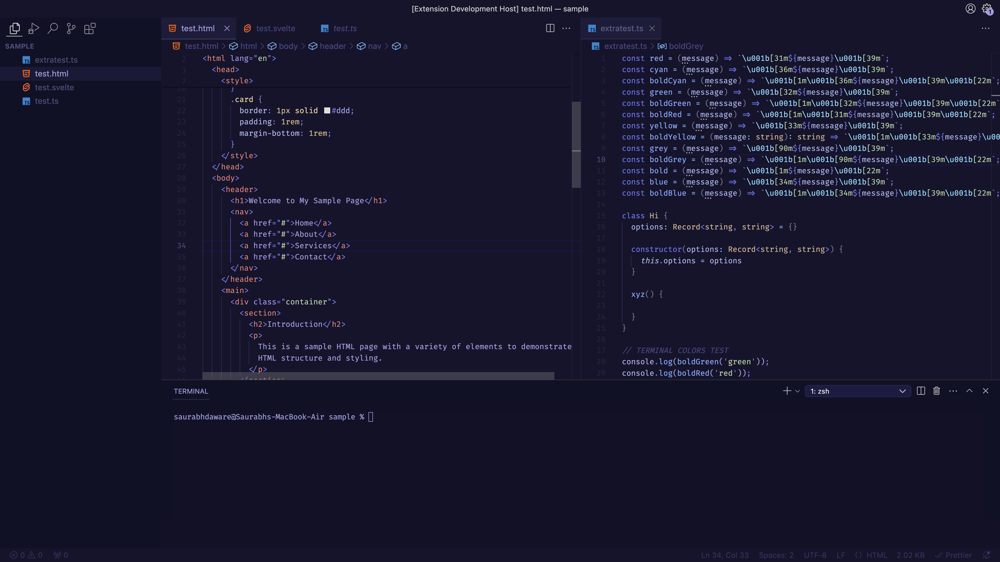
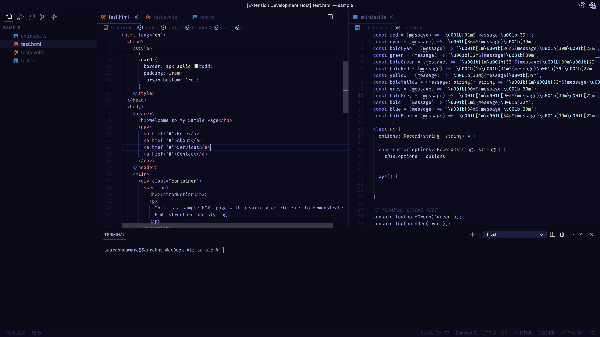
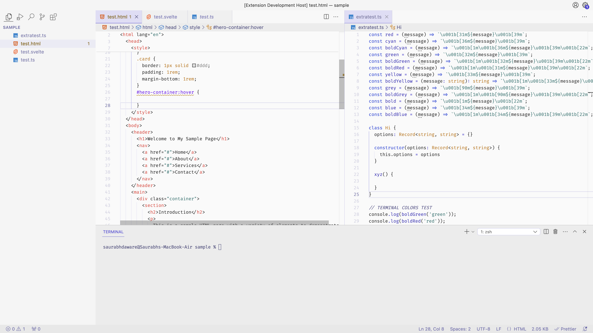

  <h1 align="center"> Calvera Dark</h1>

A Dark Blue theme for VSCode with Syntax Highlighting inspired from Material UI

<b><a href="https://marketplace.visualstudio.com/items?itemName=saurabh.calvera-dark">View on VSCode Marketplace</a></b> • <b><a href="https://www.npmjs.com/package/highlightjs-calvera-dark">Highlight.js Theme</a></b> • <b><a href="https://github.com/niyabits/calvera-dark.nvim">Neovim Port</a></b> (by <b><a href="https://github.com/niyabits">niyabits</a></b>)

<table>
  <tr><th>Theme Name</th><th>Preview</th></tr>
  <tr>
    <th>Calvera Dark</th>
    <td></td>
  </tr>
  <tr>
    <th>Calvera Dark High Contrast</th>
    <td></td>
  </tr>
  <tr>
    <th>Calvera Light</th>
    <td></td>
  </tr>
</table>

*Dark Sky Icon by Google. Downloaded from [emojipedia](https://emojipedia.org/google/android-11.0-december-2020-feature-drop/milky-way/)*

## Run Locally

- Clone the repository
- In VSCode, open `themes/calvera-dark-color-theme.json` file.
- Press `F5` or click the Run button from Run and Debug tab.

**Thanks 🌻**
