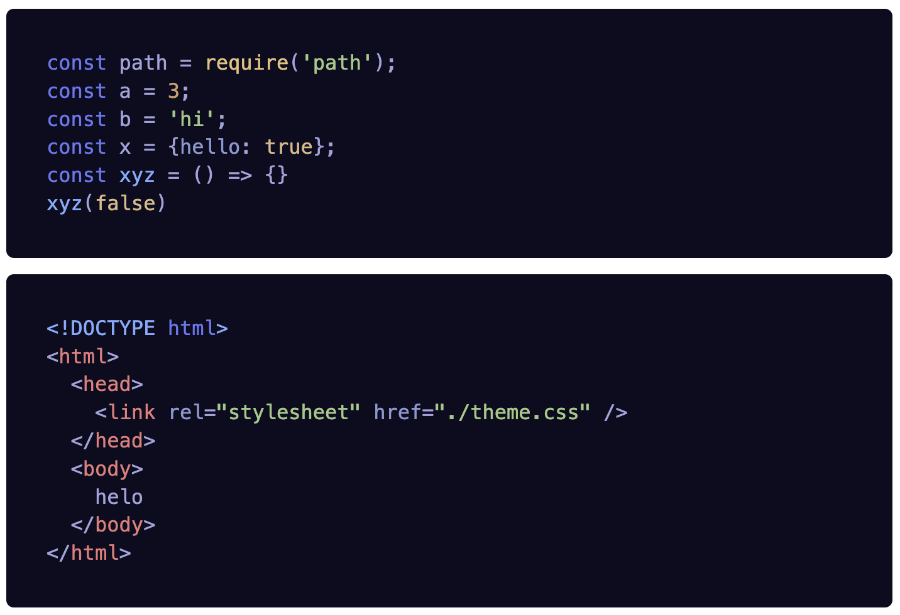

# highlightjs-calvera-dark

Highlight.js theme for [calvera dark](https://github.com/saurabhdaware/vscode-calvera-dark).



Example: https://stackblitz.com/edit/web-platform-w9beem?file=index.html

**Use from CDN**

```html
<link rel="stylesheet" href="https://unpkg.com/highlightjs-calvera-dark@0.0.1/theme.css" />
```

or 


**Use from NPM**

```sh
npm i --save highlightjs-calvera-dark
```


```js
import 'highlightjs-calvera-dark/theme.css';
```